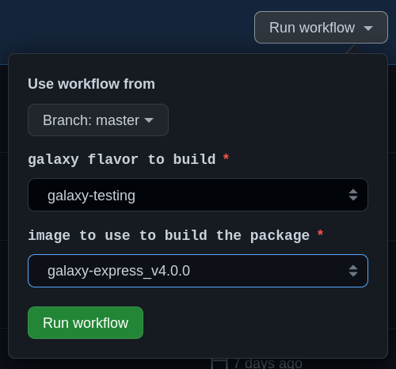

# PACKAGES on-demand update 

## Trigger packages build

The package creation is triggered by an parametrized API call performed through Github actions to the Jenkins instance the parameters passed are:
- Galaxy image
- Galaxy flavour

## Jenkins pipeline 

### Pipeline triggering 

Laniakea admins can trigger the package creation by using the github actions:
**this repo than -> actions -> on-demand-package-creation ->run workflow**  
 

### Pipeline Workflow

- Use Terraform to create a Galaxy Virtual Machine on Openstack 
- Install flavor Galaxy tools using [ansible-role-laniakea-galaxy-tools](https://github.com/Laniakea-elixir-it/ansible-role-laniakea-galaxy-tools)  
- Perform the packages creation by calling the playbook `dump.yml`
- Install the swift client and upload the packages on the Openstack object storage Swift `swift_upload.yml`
- Upload the packages on the buffer volume of the CVMFS Stratum0 tools.elixir-italy-cvmfs `cvmfs_upload.yml`. (i) Open CVMFS transaction (ii) move the package in the cvmfs volume (iii) terminate the transaction moving by publishing the updated cvmfs.
- update package version using `packages_vc.sh` 

