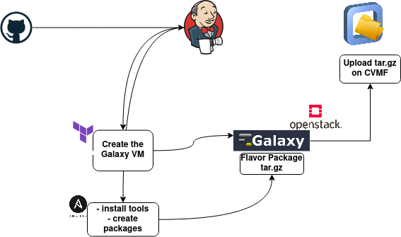

# PACKAGES on-demand update 

## Trigger packages build

- The package creation is triggered by an parametrized API call performed through Github actions to the Jenkins instance:
		- the parameters passed are, Galaxy version, Galaxy image, Galaxy flavor.

## Jenkins pipeline 

- use Terraform to create a vm on the openstack tenant
- Install Galaxy tools using the Laniakea Ansible role 
- Perform the packages creation by calling 
- upload the packeges on the openstack object storage 
- trigger CVMFS_JenkinsFile on success

## CVMFS_JenkinsFile

- Upload the packages on the buffer volume
- Open the CMFS transaction
- Publish the new data

##  Pipeline Schema 

